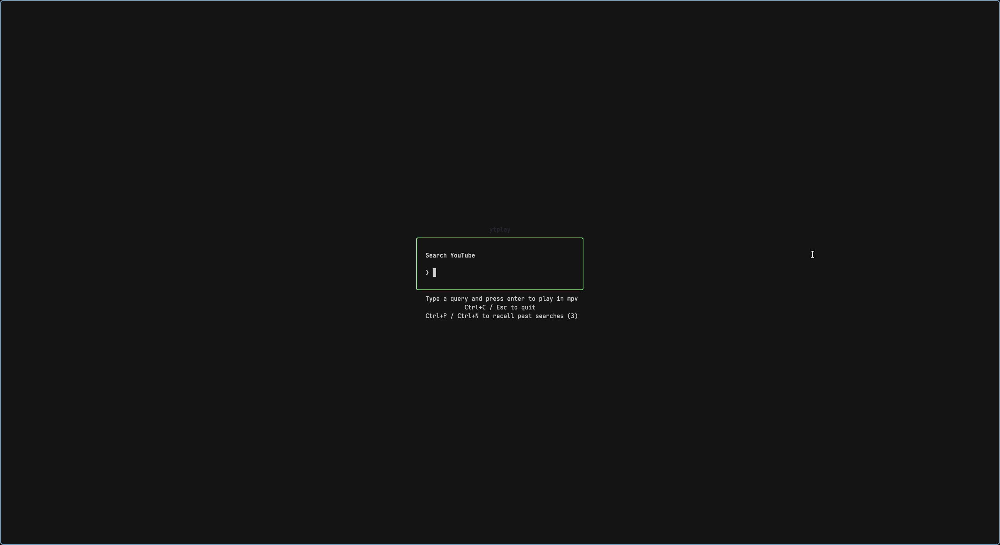
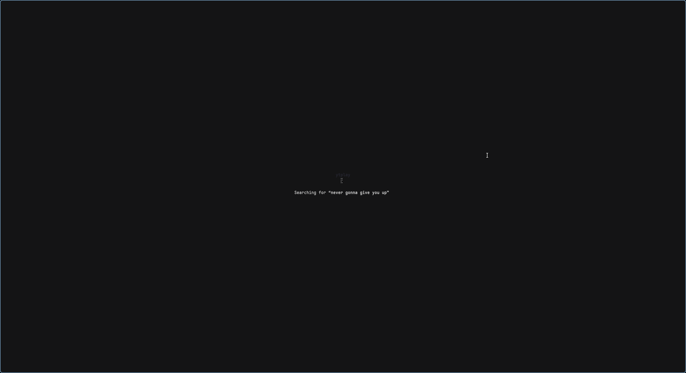
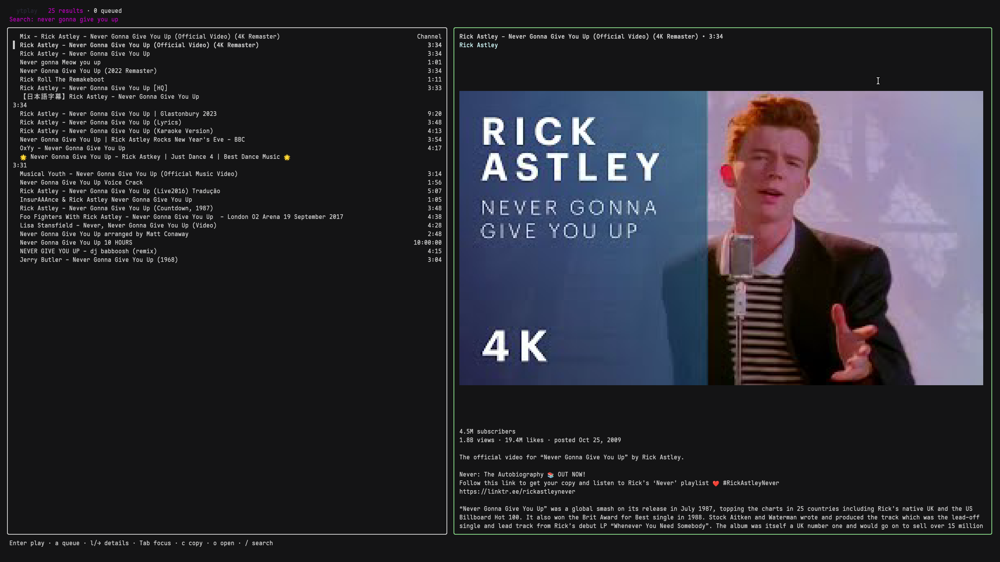

# ytplay

TUI YouTube search & play built with [Bubble Tea](https://github.com/charmbracelet/bubbletea). Search YouTube from your terminal, preview the results with inline thumbnails, and play the selected video in mpv.

## Screenshots

<table width="100%">
  <!-- Top Row: Two images side-by-side -->
  <tr>
    <td width="50%"></td>
    <td width="50%"></td>
  </tr>
  <!-- Bottom Row: One image taking up the full width -->
  <tr>
    <td colspan="2" width="100%"></td>
  </tr>
</table>

## Features

- Two-pane results view: keyboard-scrollable list, plus a preview pane with a rendered thumbnail and channel/video stats
- Infinite paging: keep scrolling near the bottom to fetch more results
- Seamless playback & auto-enqueue: `Enter` spawns mpv detached; while mpv is running, subsequent videos automatically enqueue into the active mpv session with visual feedback and an active indicator (`● mpv active`)
- Play queue: `a` stages videos (or auto-enqueues into active mpv), `q` opens a queue page to reorder (`K`/`J`), remove (`x`), clear (`X`), or play/enqueue (`Enter` or `p`)
- Channel browsing: browse a channel's videos in a two-pane list with thumbnails and stats (`Enter` on a channel result, `C` or `Tab` + `Enter` on a video, `O` opens channel in browser)
- Search history: past queries are persisted and recalled with `Ctrl+P` / `Ctrl+N` or `↑` / `↓`
- `c` copies the selected video's URL, `o` opens the video directly in your browser, `O` opens the channel
- `/` always opens the search prompt, and `Esc` always navigates back to the previous view
- Native image rendering when supported (kitty unicode placeholders / sixel), half-block ANSI art as fallback

## Usage

```
ytplay # Open TUI
ytplay <query> # Search directly
```

### Keys

| Key                        | Prompt view          |
| -------------------------- | -------------------- |
| `Enter`                    | search               |
| `Ctrl+P` / `Ctrl+N`, `↑`/`↓` | recall past searches |
| `Esc`                      | cancel / go back     |

| Key                                   | Results view                                      |
| ------------------------------------- | ------------------------------------------------- |
| `j` / `k` / `↓` / `↑`                 | move selection                                    |
| `Tab` / `Shift+Tab`                   | jump between list and channel preview             |
| `PgUp` / `PgDn` / `j`/`k` near bottom | page & load more results                          |
| `Enter`                               | play or auto-enqueue video (or browse channel)    |
| `C`                                   | view selected video's channel in ytplay           |
| `O`                                   | open channel in browser                           |
| `a`                                   | queue video (auto-enqueues into mpv if running)   |
| `x`                                   | unqueue video if currently in queue               |
| `q`                                   | open the queue view                               |
| `c`                                   | copy video URL to clipboard                       |
| `o`                                   | open video in browser                             |
| `/`                                   | open search prompt                                |
| `Esc`                                 | back to previous view (or prompt)                 |
| `Ctrl+C` / `Ctrl+D`                   | quit                                              |

| Key                                   | Channel view                                      |
| ------------------------------------- | ------------------------------------------------- |
| `j` / `k` / `↓` / `↑`                 | move selection                                    |
| `PgUp` / `PgDn` / `j`/`k` near bottom | page & load more channel videos                   |
| `Enter`                               | play or auto-enqueue selected video in mpv        |
| `a`                                   | queue video (auto-enqueues into mpv if running)   |
| `x`                                   | unqueue video if currently in queue               |
| `q`                                   | open the queue view                               |
| `c`                                   | copy video URL to clipboard                       |
| `C`                                   | copy channel URL to clipboard                     |
| `o`                                   | open video in browser                             |
| `O`                                   | open channel in browser                           |
| `/`                                   | open search prompt                                |
| `Esc`                                 | back to previous view                             |
| `Ctrl+C` / `Ctrl+D`                   | quit                                              |

| Key                   | Queue view                                             |
| --------------------- | ------------------------------------------------------ |
| `j` / `k` / `↓` / `↑` | move selection                                         |
| `K` / `J`             | move selected video up / down                          |
| `x`                   | remove selected video from queue                       |
| `X`                   | clear entire queue                                     |
| `Enter`               | play/enqueue selected video and remove it from queue   |
| `p`                   | play/enqueue all queued videos in mpv                  |
| `c`                   | copy selected video's URL                              |
| `o`                   | open video in browser                                  |
| `/`                   | open search prompt                                     |
| `Esc`                 | back to results / previous view                        |
| `Ctrl+C` / `Ctrl+D`   | quit                                                   |

Search history is stored in `~/.config/ytplay/history`.

## Nix

`flake.nix` exposes `packages.<system>.default` (a `buildGoModule`), wrapping the binary so `yt-dlp` is on `PATH`. Standalone:

```sh
nix build .
```

Consumed as a flake input in your main configuration (`inputs.ytplay.packages.${system}.default`).

## Development

```sh
go test ./...
nix run .# -- "some query"
```

Requires `yt-dlp` (`ytsearch`), `mpv`, and `xdg-open` (for the channel shortcut) at runtime.
